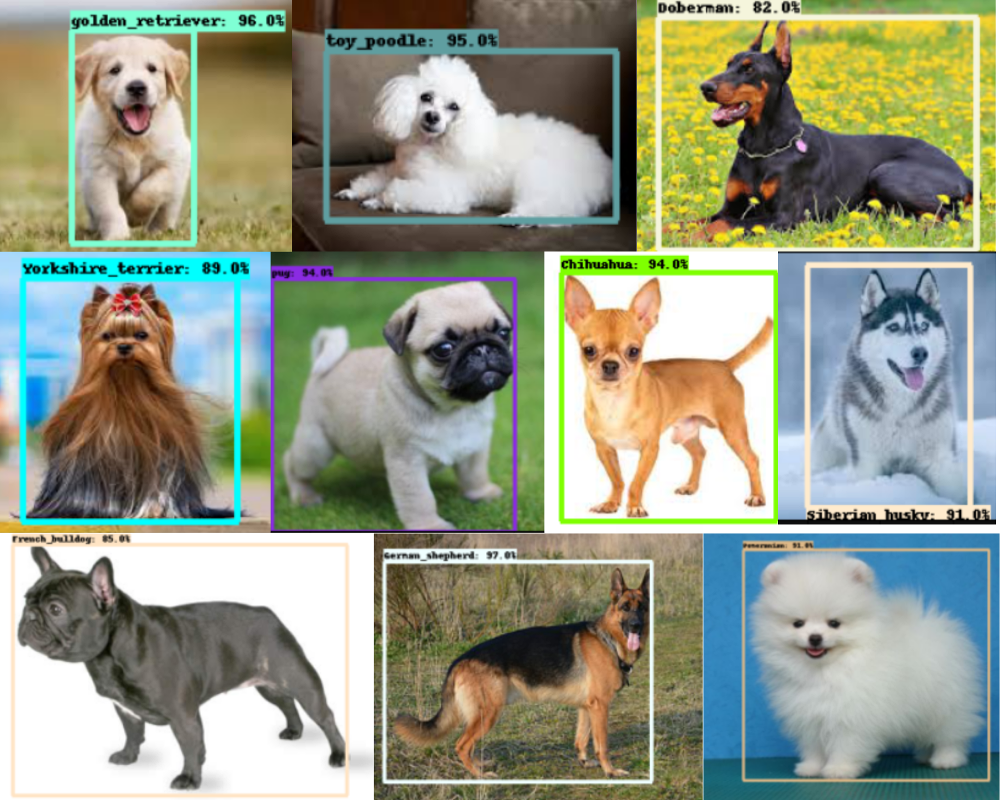

# TensorFlow_with_Colab_tutorial

  

  
  

  
  

  
   

This tutorial will guide you through all the steps required for object recognition model training, from collecting images for the model to testing the model!

Link to [tutorial](https://medium.com/@nisargkapkar/tensorflow-2-object-detection-api-with-google-colab-b2af171e81cc?source=friends_link&sk=0bb205df0e1c29a2e78c28671ddf4494)! 
